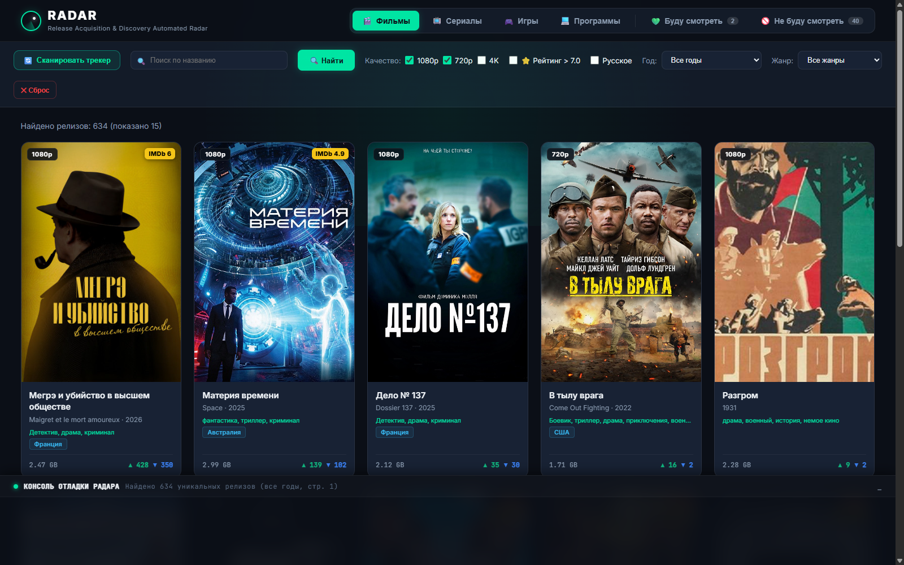
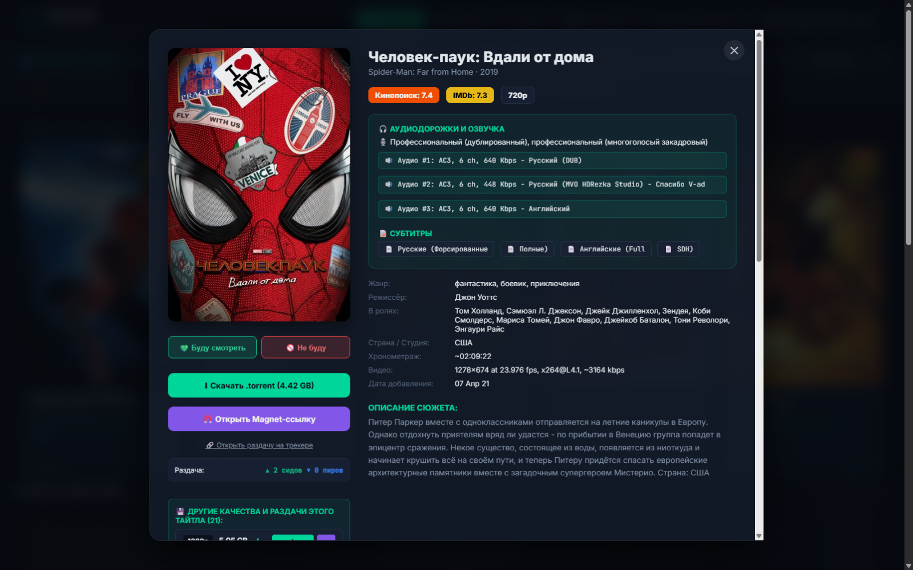

# 📡 RADAR

  <h2>Твой личный радар лучших релизов кино, сериалов и игр</h2>
  
<b>Забудь про тонны спама, рекламы и бесконечные страницы трекеров.</b>

  
Красивая витрина новинок в одном окне — чисто, быстро и прямо на твоём компьютере.

   
  
  
<i>Главная витрина: кинематографичные постеры, оценки Кинопоиск/IMDb и мгновенные фильтры</i>

   
  
  
<i>Карточка релиза: сюжет, полный список озвучек и аудиодорожек, субтитры и скачивание в 1 клик</i>

---

## 💡 Зачем нужен RADAR?

Знакома ситуация: заходишь на трекер найти фильм на вечер, а там — простыни нечитаемого текста, дубли раздач, кривые скриншоты и назойливые баннеры?

**RADAR делает всё за тебя:**
Он превращает хаос трекеров в стильный персональный каталог, похожий на современный онлайн-кинотеатр. Ты сразу видишь сочные постеры, оценки Кинопоиска и IMDb, точные списки озвучек и можешь скачать `.torrent` или `magnet`-ссылку в один клик.

---

## 🌟 Что внутри

* 🎬 **Всё по категориям:** Фильмы, Сериалы, Игры и Программы — в отдельных удобных вкладках.
* 🖼️ **Идеальные постеры:** Аккуратные вертикальные обложки в высоком разрешении, прямо как на афише кинотеатра. Если захочешь другой постер — его можно сменить в пару кликов.
* 🎙️ **По полочкам — озвучка и звук:** Никакой каши в описании. Все аудиодорожки (Дубляж, Red Head Sound, LostFilm, Кубик в Кубе) и субтитры разложены по аккуратным цветным бейджам.
* 💚 **Списки «Буду смотреть» и 🚫 «Не буду смотреть»:**
  * Сохраняй интересные находки в избранное — они всегда под рукой.
  * Скрывай то, что точно не интересно, чтобы лента оставалась свежей и чистой.
* 🎯 **Умные и понятные фильтры:**
  * Отбирай только высокое качество (1080p, 4K).
  * Включай фильмы с высоким рейтингом (⭐ > 7.0).
  * Выбирай нужный год или любимый жанр.
  * Ищи по названию, любимым актёрам или режиссёрам.
* 🔌 **Работает без интернета (Офлайн-режим):**
  * Все обложки и карточки сохранённых фильмов сохраняются на твой диск. Даже если отключится сеть, твоя коллекция останется доступной.
* 🛡️ **Полная приватность:** Никаких аккаунтов, подписок и сбора данных. Всё живёт исключительно на твоём компьютере.

---

## 🚀 Как запустить (всего 2 клика!)

Тебе не нужно разбираться в коде или терминале — всё настроено заранее.

### Шаг 1: Установка (только в первый раз)
Дважды кликни по файлу **`install.bat`** в папке программы.  
Он сам всё подготовит и установит за пару минут.

### Шаг 2: Запуск
Дважды кликни по файлу **`run.bat`**.  
RADAR сам запустится и откроется в твоём обычном браузере по адресу `http://127.0.0.1:8765`.

---

## 🧭 Как пользоваться

1. **Кнопка «🔄 Сканировать трекер»** — обновляет ленту свежими раздачами.
2. **Клик по карточке фильма** — открывает подробное окно: сюжет, трейлеры, полный список аудиодорожек, актёры и ссылка на скачивание.
3. **Кнопки 💚 и 🚫** — отправляют релиз в список «Буду смотреть» или скрывают из выдачи.
4. **Фильтры сверху** — помогают найти фильм под настроение за 10 секунд.

---

  RADAR • Приятного просмотра и отличных находок!

